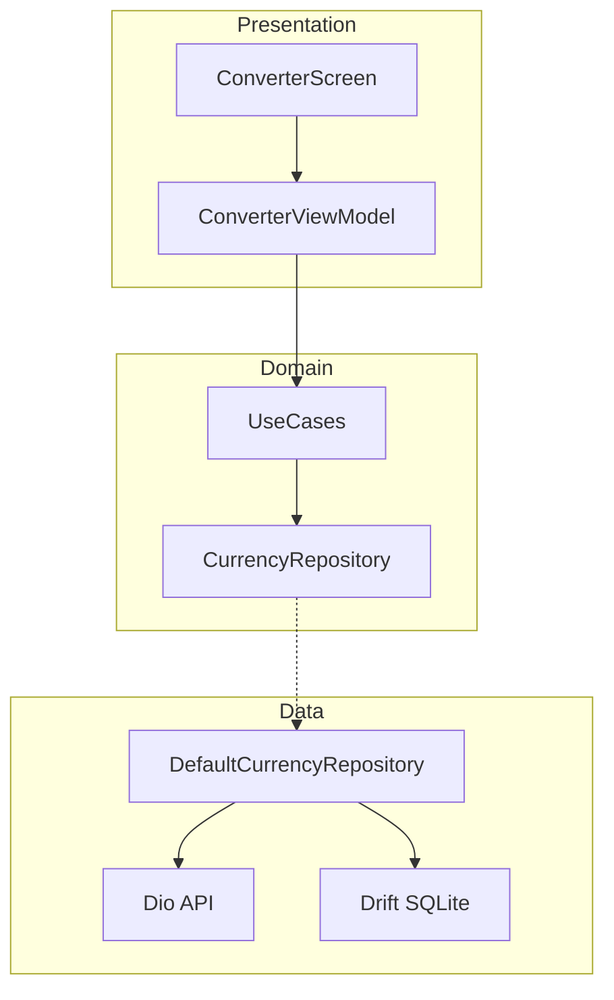

# Currency Converter

Offline-first Flutter currency converter using Clean Architecture and Material 3.

**Supported platforms:** Android and iOS only.

## Screenshots

| Light mode | Dark mode |
|------------|-----------|
|  |  |

## Prerequisites

- [FVM](https://fvm.app/)
- Flutter 3.38.10 (`fvm use 3.38.10`)

## Setup

```bash
cp .env.example .env
# Add your CurrencyFreaks API key to .env

fvm flutter pub get
fvm dart run build_runner build --delete-conflicting-outputs
```

## Run

```bash
# Android or iOS simulator/device
fvm flutter run
```

## Test

```bash
fvm flutter test
fvm flutter analyze .
```

## Architecture

The app follows **Clean Architecture** with **MVI** (Model-View-Intent). UI state is managed by BLoC `Cubit` through `BaseViewModel` and `BaseScreen`, with strict separation between data, domain, and presentation layers.



### Project structure

| Path | Responsibility |
|------|----------------|
| `lib/app/` | `MaterialApp`, Material 3 light/dark theme |
| `lib/core/` | Dependency injection, env config, utilities |
| `lib/data/currency/` | Dio API client, Drift cache, `DefaultCurrencyRepository` |
| `lib/domain/currency/` | Freezed models, repository interface, use cases |
| `lib/presentation/` | `BaseScreen` / `BaseViewModel` MVI base classes and converter feature UI |

### Layer responsibilities

**Data** (`lib/data/`) — repositories, remote/local data sources, and API response models. Remote models use `@JsonSerializable()` and map to domain via `toDomain()`.

**Domain** (`lib/domain/`) — business entities, repository interfaces, and use cases (`GetExchangeRatesUseCase`, `ConvertCurrencyUseCase`).

**Presentation** (`lib/presentation/`) — screens, ViewModels, UI models, and widgets. Feature folders follow a consistent layout: `model/`, `widget/`, `<feature>_screen.dart`, `<feature>_view_model.dart`.

### Model mapping

```
Data Layer       -> Domain Layer       -> Presentation Layer
*Response        -> *Model              -> *UiModel
  toDomain()         (pure)                fromDomain / builder
```

Presentation must never import data-layer types (e.g. `RatesResponse`).

### Offline-first flow

On launch, `ConverterViewModel` attempts a remote fetch via the repository. On success, rates are persisted to Drift and the UI shows a **last updated** timestamp. On network failure, the ViewModel falls back to the Drift cache and shows a **Using cached data** banner. Remote/local merge orchestration lives in the ViewModel, not inside repository fetch methods.

### Dependency injection

[Injectable](https://pub.dev/packages/injectable) + [GetIt](https://pub.dev/packages/get_it) wire dependencies. `configureInjection()` in `main.dart` registers services; generated registrations live in `lib/core/di/di.config.dart` (produced by `build_runner`).

### Tech stack

| Concern | Package |
|---------|---------|
| HTTP | Dio |
| Local cache | Drift (SQLite) |
| DI | GetIt + Injectable |
| Immutable models | Freezed |
| Env / API key | envied |
| State management | flutter_bloc (Cubit) |
| UI | Material 3 |

## Bundle Identifier

`com.ducbm.currencyconverter`

## API

Rates are fetched from [CurrencyFreaks](https://currencyfreaks.com/):

`GET https://api.currencyfreaks.com/v2.0/rates/latest?apikey=YOUR_KEY`

On network failure, the app loads the last cached rates from Drift and shows a **Using cached data** indicator with the last updated timestamp.
